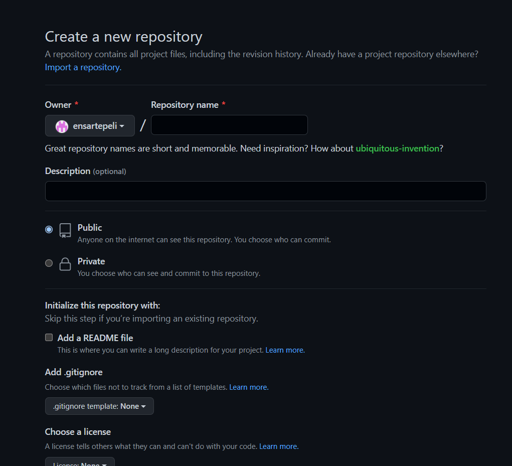

# kodluyoruzilkrepo
Bu repo Kodluyoruz Front-End Eğitiminde oluşturduğumuz ilk repo. İçerisinde bir adet README dosyası, bir adet de index.html barındırıyor.

# Installation
Oncelikle prjeyi clonelayin. 
'git clone https://github.com/ensartepeli/kodluyoruzilkrepo.git'

# Usage
Projeyi Cloneladiktan sonra Visual Studio Code programini aciniz
Linux icin
'cd kodluyoruzilkrepo
code . '
# Contributing
Pull requestler kabul edilir. Büyük değişiklikler için, lütfen önce neyi değiştirmek istediğinizi tartışmak için bir konu açınız.
# License 
[MIT](https://choosealicense.com/licenses/mit/)

